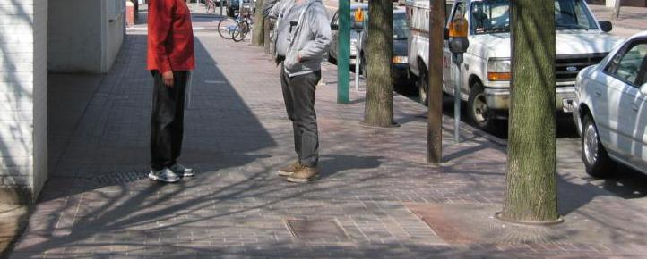
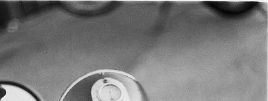
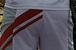

# MIT-States Dataset

#### Paper
#### Info

<!-- 
- Dataset

    |              |   |
    |:---          |---|
    |Images        |53K|
    |Objects       |245|
    |Possible state|115|

- [Standard Split](https://arxiv.org/pdf/1905.05908.pdf)

    |Set   |# of data|object-attribute pairs|
    |:---  |---      |---                   |
    |Train |30K      |1262(seen)            |
    |Valid |10K      |300(seen)/300(unseen) |
    |Test  |13K      |400(seen)/400(unseen) | -->

<!-- - [Output Space](https://arxiv.org/pdf/2101.12609.pdf)
    - Closed World
        > 1262 seen (train), 300/400 unseen (valid/test)
    - Open World 
        > 28175 (all possible) compoistions 
        - 이 중 26114(~93%)가 다른 데이터셋 split에는 없지만 open world setting에 있음. -->

    
#### Samples


|Brick Sidewalk|Gray Sidewalk|Gray Pants|
|---|---|---|
||||


#### Folder Structure
 
<!-- ```
mit-states
├── compositional-split-natural
│    ├── test_pairs.txt
│    ├── train_pairs.txt
│    └── val_pairs.txt
│      
├── images
│   ├── adj aluminum
│   ├── broken road
│   ├── ...
├── metadata_compositional-split-natural.t7
``` -->